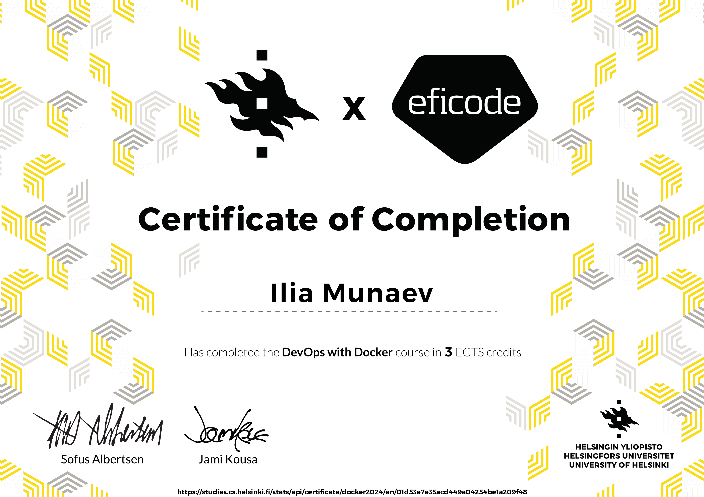

# DevOps-with-Docker-TKT21036
### Exercises Repo  

**Course:** DevOps with Docker  
**University:** University of Helsinki  

### Learning objectives  
- **Part 1: DevOps with Docker (TKT21036)**

Understand the fundamental concepts of Docker, including images and containers.
Learn how to build Docker images for existing projects and run them.
Understand how Docker can simplify the development process.

- **Part 2: Docker-compose (TKT21037)**

Learn how to manage complex multi-container applications with Docker Compose.
Understand the role of Docker Compose in container orchestration
Practice deploying and managing real-world applications using Docker Compose.

- **Part 3: Security and optimization (TKT21038)**

Learn how to optimize Docker images for production, including reducing image size and improving security.
Understand the limitations of using Docker Compose in production environments and the need for more advanced orchestration tools.
Explore alternative container orchestration solutions, including Kubernetes.

**Participant:** Ilia Munaev  
**Email:** ilyamunaev@gmail.com  
**LinkedIn:** [linkedin.com/in/iliamunaev/](https://www.linkedin.com/in/iliamunaev/)

